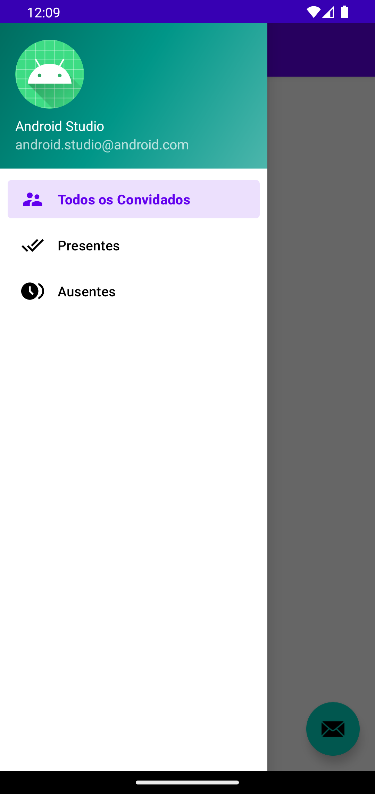
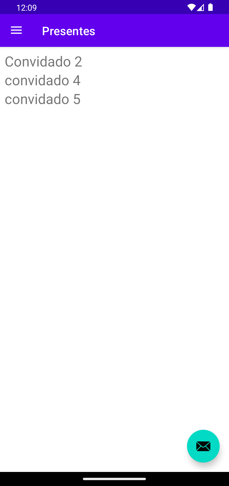
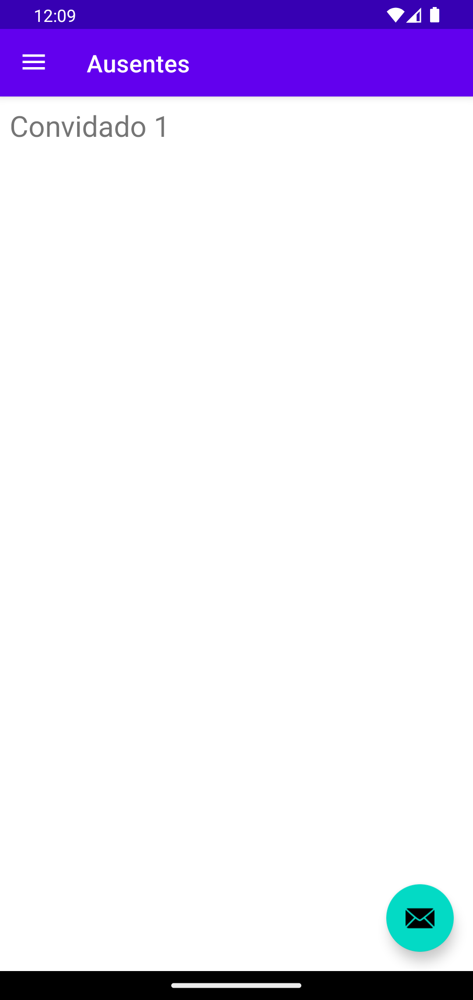
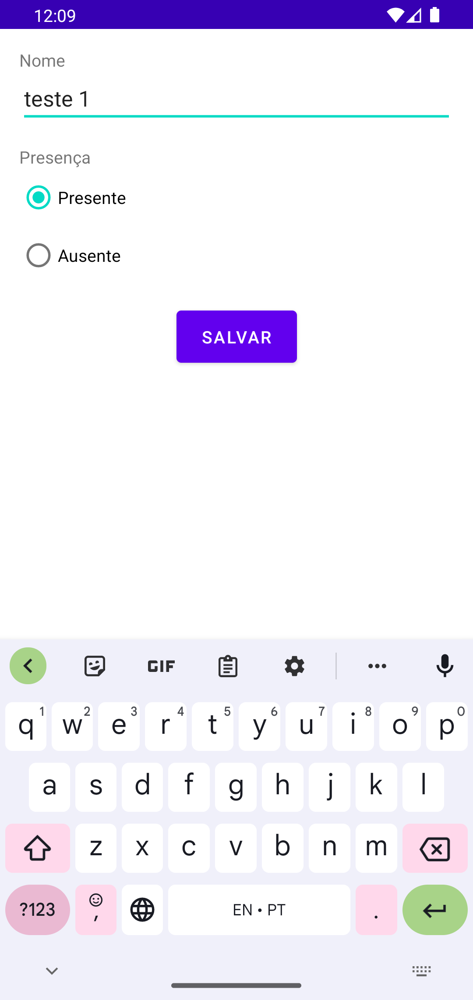

<h1>🏠 Convidados App </h1>

Este repositório contém um projeto de estudo focado na implementação da arquitetura MVVM (Model-View-ViewModel) utilizando SQLite para o armazenamento de dados. O objetivo deste projeto é demonstrar como organizar e estruturar um aplicativo seguindo os princípios da arquitetura MVVM sem o uso de APIs externas ou bibliotecas como Retrofit. 

<h1>📸 Screenshots</h1>

   
  
  
  
  

<h1>✨ Principais componentes do projeto</h1>

  ● Model: Responsável pela definição das entidades e pela interação com o banco de dados SQLite.

  ● View: Contém a interface gráfica do usuário, que observa as mudanças nos dados.

  ● ViewModel: Atua como intermediário entre a View e o Model, gerenciando a lógica de negócios e a comunicação entre eles.

<h1>🎓 Author</h1>

 Marcos Onofre (contact me  <a href="https://www.linkedin.com/in/marcos-onofre-3263b6240/">Linkedin</a>)

